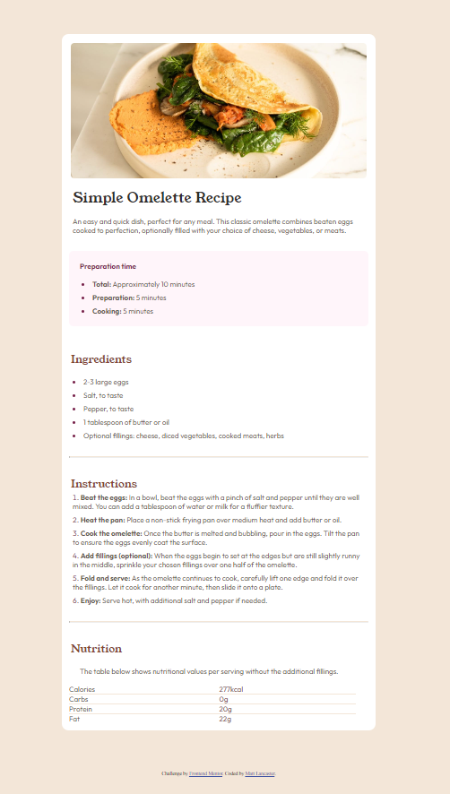

# Frontend Mentor - Recipe page solution

This is a solution to the [Recipe page challenge on Frontend Mentor](https://www.frontendmentor.io/challenges/recipe-page-KiTsR8QQKm). Frontend Mentor challenges help you improve your coding skills by building realistic projects. 

## Table of contents

- [Overview](#overview)
  - [The challenge](#the-challenge)
  - [Screenshot](#screenshot)
  - [Links](#links)
- [My process](#my-process)
  - [Built with](#built-with)
  - [Continued development](#continued-development)
  - [Useful resources](#useful-resources)
- [Author](#author)

## Overview

### Screenshot

### Links

- Solution URL: [https://github.com/lank81/RecipePage]
- Live Site URL: [https://lank81.github.io/RecipePage]

## My process

### Built with

- Semantic HTML5 markup
- CSS custom properties
- Flexbox
- Mobile-first workflow

### Continued development

This one was a little tougher as there was a lot of styling I haven't done before.  A lot if it stemmed around Lists and their styling.  I was really happy with finishing this one though as it's a style/site I'd love to do.  As time goes on I'm looking forward to gaining a greater understanding of styles and responsive web design.

**Note: Delete this note and the content within this section and replace with your own plans for continued development.**

### Useful resources

- [W3School](https://www.w3schools.com/html/html_lists.asp) - This helped me for styling my numbered and decimal lists
- [stackoverflow](https://www.stackoverflow.com) - The obvious site for anything dealing with coding.  I used this to learn about :before and :marker.

## Author

- Frontend Mentor - [@lank81](https://www.frontendmentor.io/profile/lank81)
